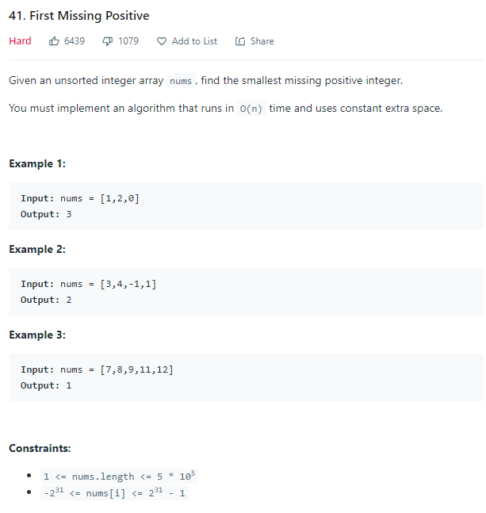
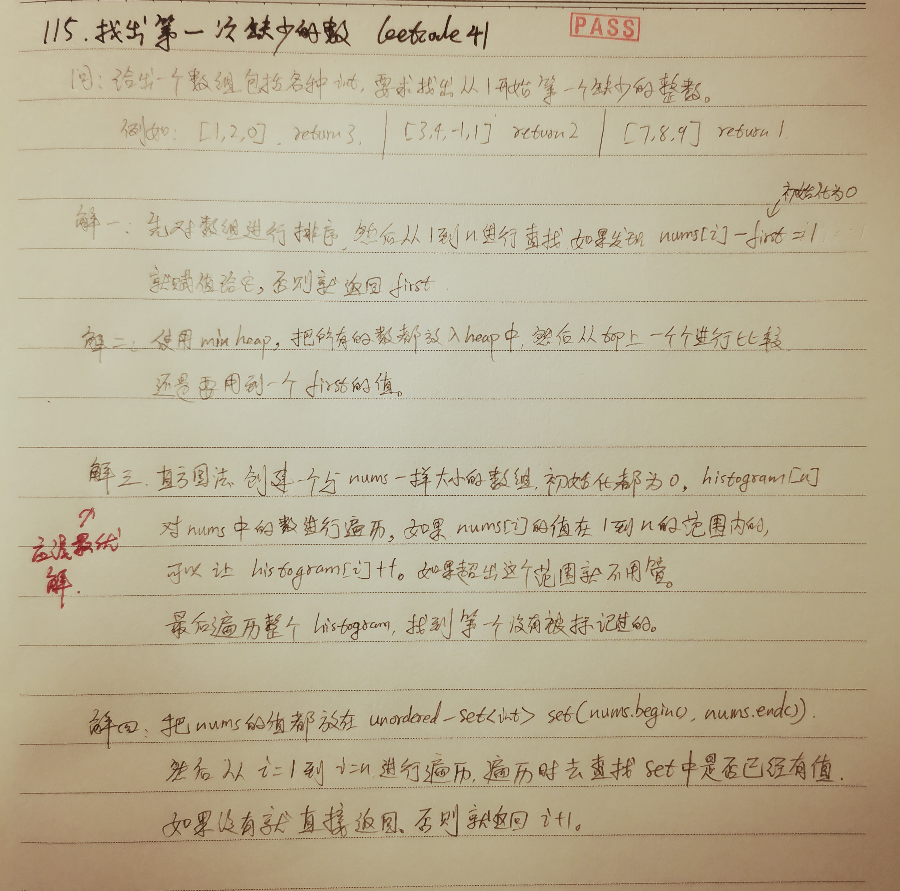

这个可以使用很多的方法，但是最有效的应该是直方图（histogram)的方法
因为给了一个size等于n的nums，那么最差的情况，就是这个nums存放了1, 2, 3,......n
如果里面的数字不在，或一部分在这个1-n之间，也没有事，不在这个范围的，就不要记录下来就行了。
如果在这个范围内的，就用一个histogram[i] = true就可以了
然后再从1到N进行遍历histogram,找到第一个不是 true的位置就行了

