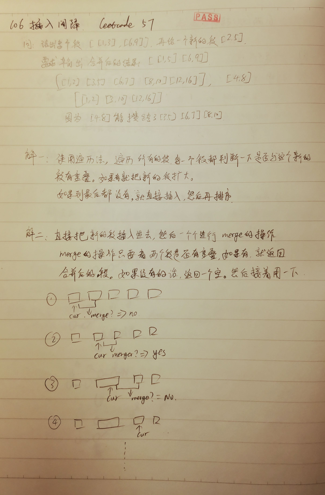

Given a set of non-overlapping intervals, insert a new interval into the intervals (merge if necessary).

You may assume that the intervals were initially sorted according to their start times.

 

Example 1:

Input: intervals = [[1,3],[6,9]], newInterval = [2,5]
Output: [[1,5],[6,9]]
Example 2:

Input: intervals = [[1,2],[3,5],[6,7],[8,10],[12,16]], newInterval = [4,8]
Output: [[1,2],[3,10],[12,16]]
Explanation: Because the new interval [4,8] overlaps with [3,5],[6,7],[8,10].
Example 3:

Input: intervals = [], newInterval = [5,7]
Output: [[5,7]]
Example 4:

Input: intervals = [[1,5]], newInterval = [2,3]
Output: [[1,5]]
Example 5:

Input: intervals = [[1,5]], newInterval = [2,7]
Output: [[1,7]]
 

Constraints:

0 <= intervals.length <= 104
intervals[i].length == 2
0 <= intervals[i][0] <= intervals[i][1] <= 105
intervals is sorted by intervals[i][0] in ascending order.
newInterval.length == 2
0 <= newInterval[0] <= newInterval[1] <= 105

题目如果使用一个个进行比较的话，就会比较麻烦一点。
但是如果使用一个个进行合并的话，就会简单的多

