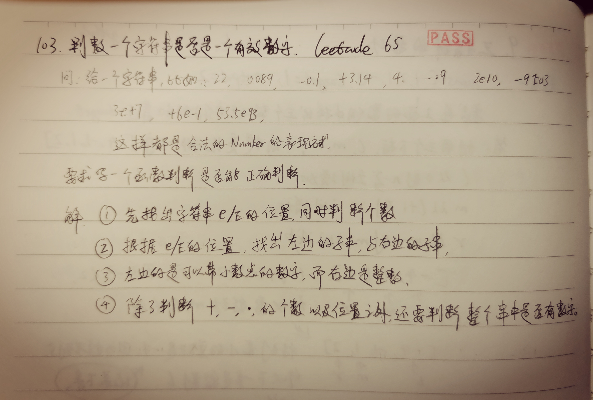

A valid number can be split up into these components (in order):

A decimal number or an integer.
(Optional) An 'e' or 'E', followed by an integer.
A decimal number can be split up into these components (in order):

(Optional) A sign character (either '+' or '-').
One of the following formats:
One or more digits, followed by a dot '.'.
One or more digits, followed by a dot '.', followed by one or more digits.
A dot '.', followed by one or more digits.
An integer can be split up into these components (in order):

(Optional) A sign character (either '+' or '-').
One or more digits.
For example, all the following are valid numbers: ["2", "0089", "-0.1", "+3.14", "4.", "-.9", "2e10", "-90E3", "3e+7", "+6e-1", "53.5e93", "-123.456e789"], while the following are not valid numbers: ["abc", "1a", "1e", "e3", "99e2.5", "--6", "-+3", "95a54e53"].

Given a string s, return true if s is a valid number.

 

Example 1:

Input: s = "0"
Output: true
Example 2:

Input: s = "e"
Output: false
Example 3:

Input: s = "."
Output: false
Example 4:

Input: s = ".1"
Output: true
 

Constraints:

1 <= s.length <= 20
s consists of only English letters (both uppercase and lowercase), digits (0-9), plus '+', minus '-', or dot '.'.

这个题目没有太多的技巧，其实就是一个对规则的理解，然后先找出那个e/E，然后把左边的字符串当成是“带小数的数”， 把右边的字符串当成是“整数”进行一下判断，就可以了

