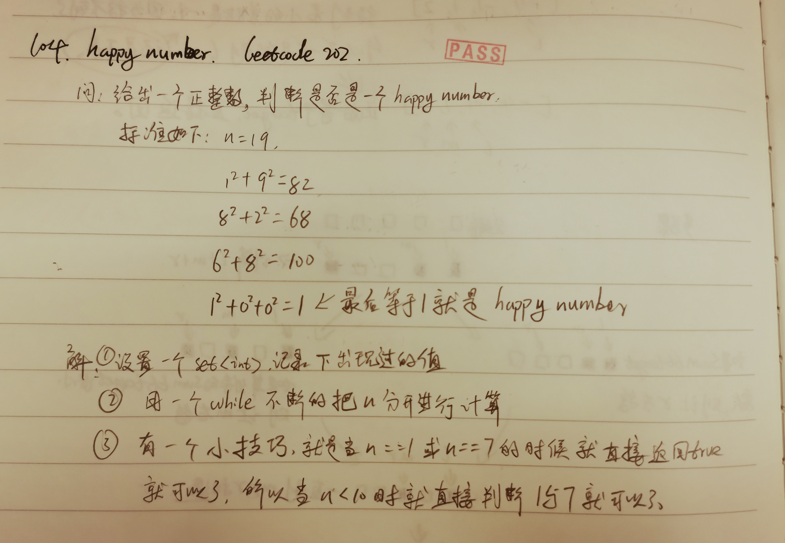

Write an algorithm to determine if a number n is happy.

A happy number is a number defined by the following process:

Starting with any positive integer, replace the number by the sum of the squares of its digits.
Repeat the process until the number equals 1 (where it will stay), or it loops endlessly in a cycle which does not include 1.
Those numbers for which this process ends in 1 are happy.
Return true if n is a happy number, and false if not.

 

Example 1:

Input: n = 19
Output: true
Explanation:
12 + 92 = 82
82 + 22 = 68
62 + 82 = 100
12 + 02 + 02 = 1
Example 2:

Input: n = 2
Output: false

这个题目看上去是比较简单的，就是把一个数字拆开，然后把单个数字2次方，然后把它们加起来，如果等于1的话，就结束了，如果有循环的话，那就退出
然后里面有一个小的技巧，就是如果n是小于10的话，就不用计算了，因为当n小于10的时候，只有1和7是满足要求的

