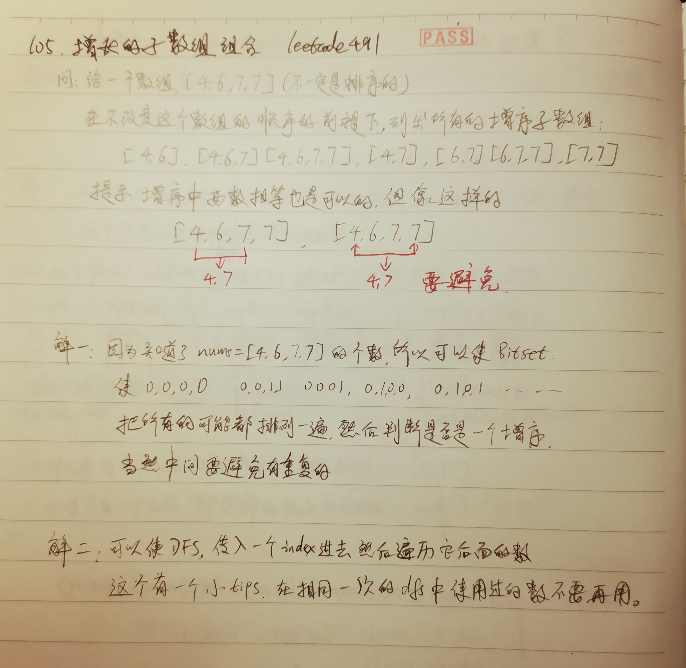

Given an integer array nums, return all the different possible increasing subsequences of the given array with at least two elements. You may return the answer in any order.

The given array may contain duplicates, and two equal integers should also be considered a special case of increasing sequence.

 

Example 1:

Input: nums = [4,6,7,7]
Output: [[4,6],[4,6,7],[4,6,7,7],[4,7],[4,7,7],[6,7],[6,7,7],[7,7]]
Example 2:

Input: nums = [4,4,3,2,1]
Output: [[4,4]]
 

Constraints:

1 <= nums.length <= 15
-100 <= nums[i] <= 100

题目是比较常见的DFS,主要要使用到一个set<int>来避免一些重复的问题

